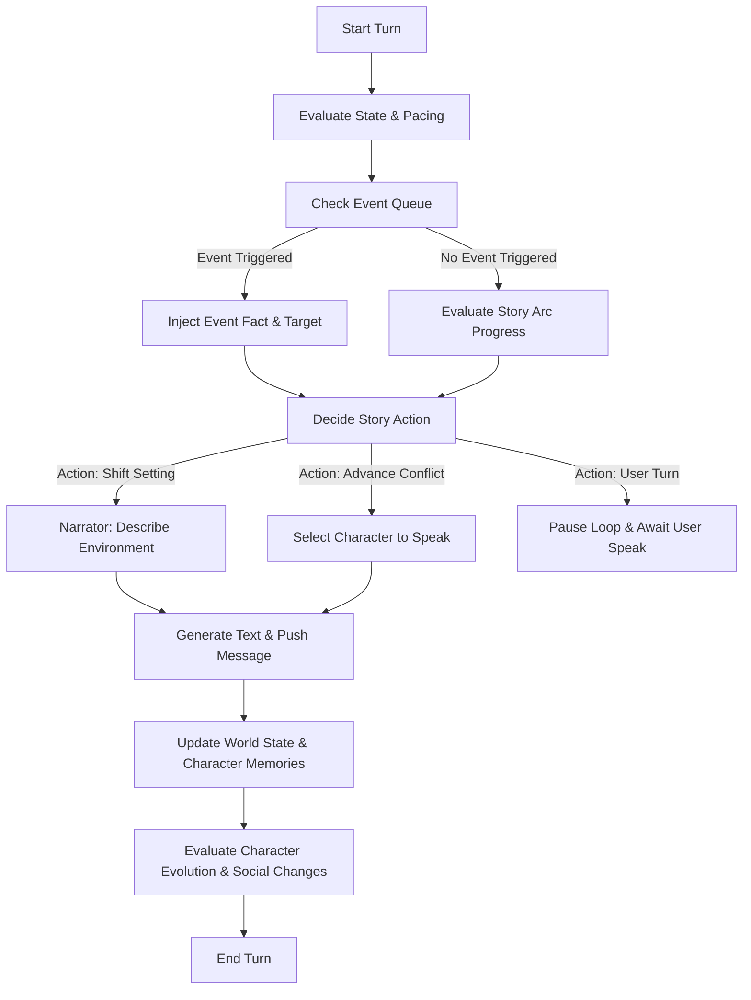
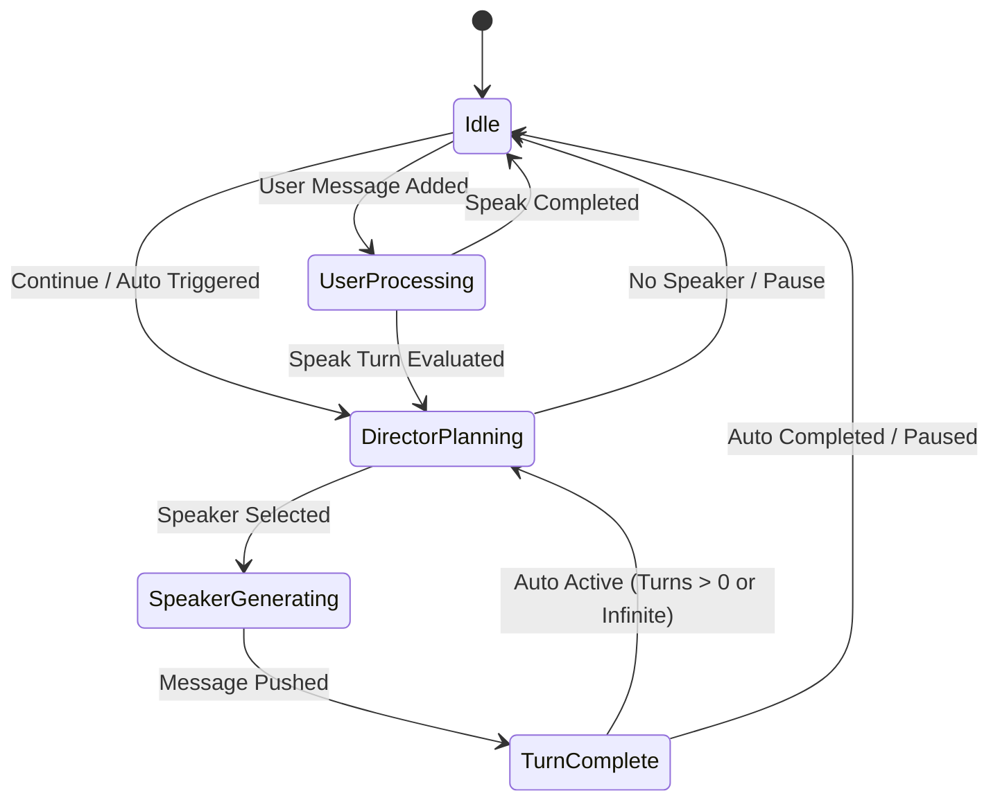

# Living Novel Engine Design Specification

This document provides the complete architecture and functional specification for the **Living Novel Engine** (running in `LivingNovelEngine.js`).

---

## 1. Engine Core & Module Responsibilities

The engine resides in a single JavaScript file, `LivingNovelEngine.js`, structured into modular internal sections:

1. **State Manager (`StateManager`)**:
   - Initialises, validates, and serialises the engine's persistent state in `oc.thread.customData.livingNovelEngine`.
   - Handles deep cloning and safety fallbacks.
2. **Command Parser (`CommandParser`)**:
   - Intercepts user messages on `MessageAdded` for manual slash commands (`/continue`, `/auto5`, `/autoloop`, `/pause`, `/director`) and `CANON:` directives.
3. **Prompt Builder (`PromptBuilder`)**:
   - Compiles prompts for LLM generation by merging the global world state, character sheets, relationship graphs, and filtered character memories.
4. **Director Core (`DirectorCore`)**:
   - Evaluates the scene, tracks story arcs, queues events, updates memory, and decides how the story progresses and who speaks next.
5. **Narrator & Speaker Module (`SpeakerModule`)**:
   - Manages text generation for the Narrator and individual active Characters.
6. **UI Controller (`UIController`)**:
   - Handles progressive enhancement UI (if iframe capabilities permit) and hooks event listeners.

---

## 2. Module Dependency Rule

> [!IMPORTANT]
> **Strict Dependency Rule**:
> - Only `StateManager` may directly write to the persistent state store.
> - All modules must communicate through public interfaces.
> - Direct mutations by other modules are forbidden.

### Allowed Interaction Flow:
```
Director
   ↓ (Requests mutation)
StateManager.mutate(callback)
   ↓ (Clones, validates, writes)
Persistent State
```

### Forbidden Operations:
- `Director` -> direct `worldState` mutation
- `Narrator` -> direct `relationshipGraph` mutation
- `CharacterMemory` -> direct `chapter` mutation

---

## 3. Engine Status Schema

`LivingNovelEngine.EngineStatus` exposes telemetry and runtime health info:
- `initialized` (boolean): `true` if bootstrap and state init succeeded.
- `version` (string): Current semantic version (e.g. `"1.0.0"`).
- `build` (string): Unique build date/stamp.
- `runtime` (string): `"perchance"` or `"node"` depending on sandbox detection.
- `lastSave` (string|null): ISO timestamp of the last save operation.
- `debugEnabled` (boolean): Toggle status of internal debug logging.

---

## 4. Persistent State Layout

All persistent state is stored in `oc.thread.customData.livingNovelEngine`:

```json
{
  "worldState": {
    "location": {
      "name": "string",
      "description": "string",
      "mood": "string",
      "sensory": {
        "temperature": "string",
        "sounds": [],
        "atmosphere": "string"
      }
    },
    "time": {
      "epoch": 0,
      "timeOfDay": "string",
      "daysElapsed": 0
    },
    "facts": [
      { "id": "fact_id", "statement": "string", "verified": true }
    ],
    "props": [
      { "id": "prop_id", "name": "string", "description": "string", "location": "string", "owner": "string" }
    ]
  },
  "relationshipGraph": {
    "nodes": ["charId"],
    "edges": {
      "charId_from": {
        "charId_to": {
          "affinity": 0,
          "trust": 0,
          "dominance": 0,
          "history": "string"
        }
      }
    }
  },
  "characterStates": {
    "charId": {
      "name": "string",
      "personalityDescription": "string",
      "intentions": "string",
      "confidence": 0,
      "memories": [
        {
          "id": "mem_id",
          "content": "string",
          "type": "factual | emotional | intention",
          "importance": 5,
          "timestamp": 0
        }
      ]
    }
  },
  "pendingEvents": [
    {
      "id": "event_id",
      "triggerType": "turnCount | condition | immediate",
      "triggerVal": 0,
      "condition": "string",
      "description": "string",
      "resolved": false
    }
  ],
  "storyArc": {
    "currentAct": 1,
    "theme": "string",
    "goal": "string",
    "checkpoints": [
      { "id": "cp_id", "description": "string", "reached": false }
    ],
    "progress": 0
  },
  "chapter": {
    "number": 1,
    "title": "string",
    "summary": "string"
  },
  "uiState": {
    "isWindowVisible": false,
    "theme": "dark"
  },
  "autoState": {
    "mode": "idle", 
    "turnsRemaining": 0,
    "isRunning": false
  },
  "lastSpeaker": "string"
}
```

---

## 5. Module Specifications & Architecture

### Director Philosophy
The **Director** is the authorial intent of the novel. It is not a passive turn-rotator; it acts as a creative showrunner to maximize narrative quality:
- **Tension & Pacing**: Prioritizes dramatic momentum over equal speaker allocation. If two characters are locked in conflict, the Director may allow them to trade lines repeatedly, bypassing other characters or the Narrator entirely.
- **Dramatic Irony**: Operates with complete global state knowledge. It knows every character's private goals, memories, and true affinity scores, but deliberately filters what each character knows during generation to create misunderstandings, suspense, and organic conflict.
- **Proactive Storytelling**: Drives the narrative forward by forcing actions, introducing environmental shifts, or triggering queued events rather than waiting for the user to dictate every plot step.

### Event Queue
The event queue (`pendingEvents`) schedules plot twists, environmental shifts, character entries, or status changes.
- **Processing**: At the start of every planning phase, the Director evaluates all unresolved events in `pendingEvents`.
- **Condition Matching**: If an event's trigger condition (evaluated against `worldState`, `relationshipGraph`, or turn numbers) is met, the Director resolves it immediately, injecting it as the active narrative target for the turn.

### Relationship Graph Schema
- **Directed Social Edge**: Social links are directed. Character A's affinity towards Character B does not automatically dictate Character B's feelings towards Character A.
- **Metrics**:
  - `affinity` (-100 to 100): Friendship/love vs. hostility/hatred.
  - `trust` (-100 to 100): Belief in reliability/goodwill vs. suspicion/betrayal.
  - `dominance` (-100 to 100): Submission/subservience (-100) vs. authority/leadership (+100).
  - `history`: A summary string recording major interactions (e.g., "Argued about the key at the tavern").

### Character Memory Model
Memories are stored in `characterStates[charId].memories` and typed:
- `factual`: Objective events observed directly.
- `emotional`: Subjective impressions formed about others or events.
- `intention`: Secret plans, beliefs, or agendas not shared publicly.
- **Retrieval & Prompt Injection**: The `PromptBuilder` uses a keyword-matching or recency filter to match the current scene description and last 3 message turns. It extracts the top 3-5 relevant memories and injects them into the character's system prompt context.

### World State Schema
- **Location Setting**: Tracks physical coordinates/room name, descriptive text, active mood (e.g. "tense", "sombre"), and sensory aspects (temperature, sounds, smells).
- **Facts Log**: A database of established historical truths. Once a fact is marked `verified` (e.g. through a `CANON:` command or Director confirmation), it cannot be contradicted by character dialogue.
- **Props**: Physical items tracked by the engine, detailing description, location (e.g. room name), and owner (e.g. a character's ID or "floor").

### Character Evolution Rules
Characters evolve based on social and plot changes:
- **Confidence Shifts**: Successful actions or positive dialogue boost confidence. Failures or submission lower confidence.
- **Intention Updates**: If a character's relationship metrics cross critical boundaries (e.g., trust drops below -50), their intention switches to defensive/deceptive agendas.
- **Evolution Check**: After every turn, the Director evaluates whether the speaker's confidence, affinity, or intentions should be mutated, saving updates directly to `characterStates`.

### User Character
The player's character in the world.
- **Manual Speak**: The user types text in the chat input.
- **State Updates**: On user input, the engine updates the user's `characterStates` entry (intentions, confidence) and relationship scores based on the Director's assessment of their input.

---

## 6. Director Decision Tree

Every Turn progression follows this logical sequence, ensuring story choices dictate speaker choices:



### Turn Phase Steps:
1. **State Evaluation**: Load recent turns, facts, and story objectives.
2. **Event Checking**: Resolve any pending events where conditions match.
3. **Pacing Assessment**: Check tension level. (e.g. If tension is low and a checkpoint is reached, choose to advance the plot).
4. **Choose Narrative Objective**:
   - *Introduce Drama*: Inject a new fact, environmental challenge, or rumor.
   - *Simulate Conflict*: Force an interaction between two opposing characters.
   - *Describe Atmosphere*: Call the Narrator to describe changes in setting.
5. **Select Speaker**: Assign speaker name based on narrative objective.
6. **Generate & Apply Updates**: Generate message content, filter memories, extract factual changes, update relationships, and check character evolution.

---

## 7. Operational Modes & Commands

- **Continue**: Executes 1 Director turn. The Director plans -> chooses speaker -> speaker generates message -> state updates -> halts.
- **Auto x5**: Sets `autoState.turnsRemaining = 5` and runs 5 consecutive turns.
- **Infinite Auto**: Sets `autoState.turnsRemaining = -1` and runs until paused or user interrupts.
- **Pause**: Sets `autoState.isRunning = false` and cancels the automated loop.
- **Speak**: A manual user reply. Directly treated as canon, triggers relationship/personality updates, and pauses auto loop.
- **Director Discussion**: Generates a private Director message outlining planning, intentions, and next steps before generating public content.
- **CANON Commands**: Messages prefixed with `CANON:`.
  - Syntax: `CANON: Set relationship characterA to characterB affinity 50` or `CANON: Trigger event storm`.
  - The Director parses these commands and mutates state immediately.

---

## 8. Rewrite & Retcon Policies

### Rewrite Policy
- Applied when minor corrections or style edits are needed.
- Uses `oc.thread.messages.splice()` or directly modifies `message.content` of the last generated turn.

### Retcon Policy
- Applied when structural story details must change (e.g., resetting a scene or changing a past fact).
- The Director wipes state fields or deletes several messages from `oc.thread.messages`, inserting a new Director instruction block to adjust memories.

---

## 9. State Machine



- **Idle**: Waiting for user action or slash command.
- **DirectorPlanning**: Director writes private thoughts and decides the next action/speaker.
- **SpeakerGenerating**: Selected character or Narrator is generating text via `oc.generateText()`.
- **UserProcessing**: User input is analyzed to update relationships and world state.
